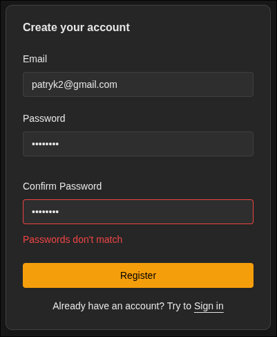
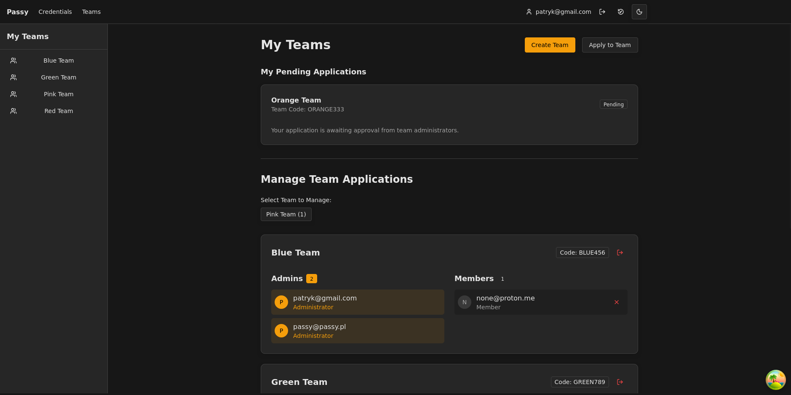
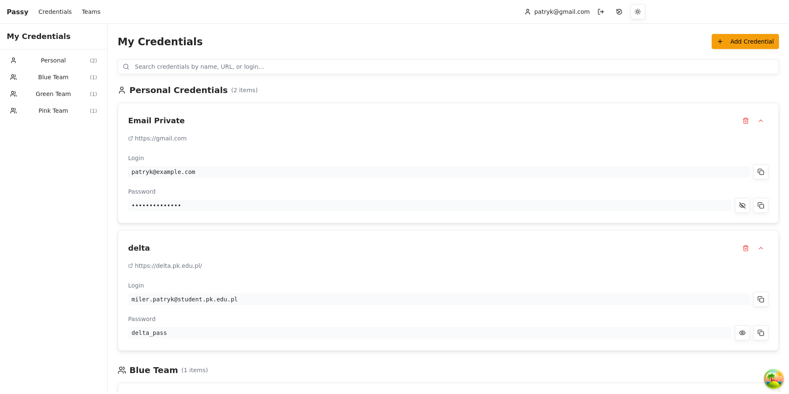
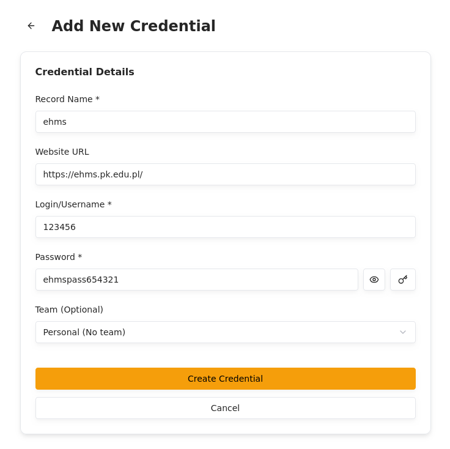
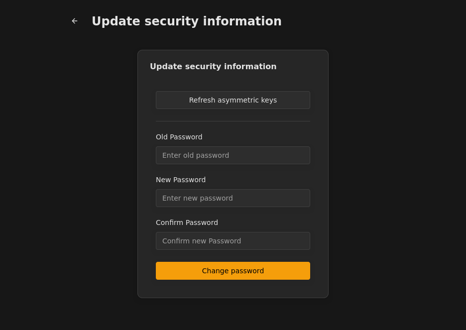

# Passy

Thesis project - Public Copy
Password manager with passwords sharing and client-side encryption.

## Running (inside nix devshell):

### Launch in development mode:

```sh
passy dev
```

### Launch in production mode:

```sh
passy
```

## Screenshots

### Authentication

**Register:**



**Login:**


### Features

**Teams:**



**Credentials:**



**Add new credential:**



**Change account secrets:**


